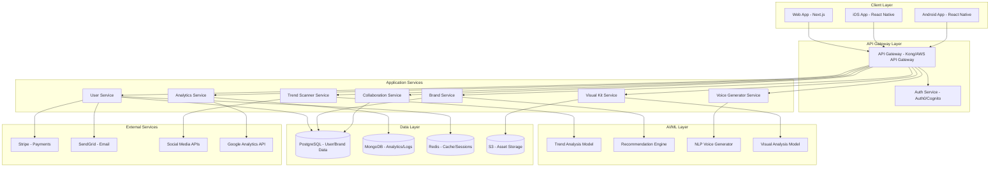
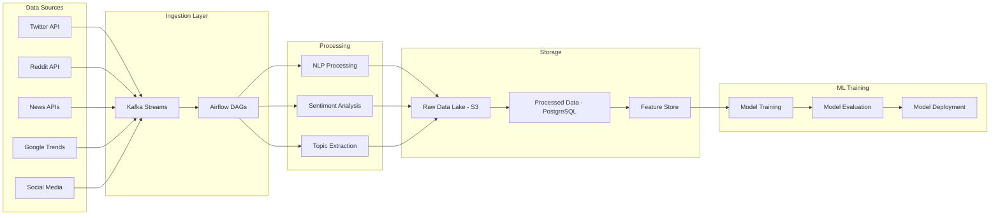

# Design Document: The Brand Chameleon

## Overview

The Brand Chameleon is a sophisticated SaaS platform that combines AI-driven market analysis with brand strategy tools to help businesses create adaptive brands. The system architecture follows a microservices pattern with a React/Next.js frontend, Node.js/Python backend services, and machine learning pipelines for trend analysis and recommendation generation.

The design emphasizes:
- **Scalability**: Microservices architecture supporting millions of users
- **Real-time responsiveness**: WebSocket connections for live updates
- **AI-driven insights**: Machine learning models for trend detection and brand optimization
- **Cross-platform consistency**: Shared design system across web and mobile
- **Data security**: End-to-end encryption and compliance with privacy regulations

## Architecture

### High-Level Architecture



### Technology Stack

**Frontend:**
- **Web**: Next.js 14 (React 18), TypeScript, Tailwind CSS, Framer Motion (animations)
- **Mobile**: React Native with Expo, TypeScript, React Native Paper (UI components)
- **State Management**: Zustand for global state, React Query for server state
- **Real-time**: Socket.io client for live updates

**Backend:**
- **API Services**: Node.js with Express/Fastify, TypeScript
- **AI/ML Services**: Python with FastAPI, TensorFlow/PyTorch, Hugging Face Transformers
- **API Gateway**: Kong or AWS API Gateway
- **Authentication**: Auth0 or AWS Cognito with JWT tokens

**Data Storage:**
- **Primary Database**: PostgreSQL 15 (user data, brand profiles, subscriptions)
- **Document Store**: MongoDB (analytics events, logs, unstructured data)
- **Cache**: Redis (sessions, frequently accessed data, rate limiting)
- **Object Storage**: AWS S3 or Cloudflare R2 (logos, visual assets, exports)
- **Search**: Elasticsearch (trend search, brand discovery)

**AI/ML Stack:**
- **NLP**: Hugging Face Transformers (GPT-based models for voice generation)
- **Trend Analysis**: Custom models using scikit-learn, TensorFlow
- **Image Analysis**: OpenCV, PIL for visual brand analysis
- **Recommendation Engine**: Collaborative filtering + content-based hybrid model
- **Model Serving**: TensorFlow Serving or TorchServe
- **Training Pipeline**: Apache Airflow for orchestration, MLflow for experiment tracking

**Infrastructure:**
- **Cloud Provider**: AWS (primary) with multi-region deployment
- **Container Orchestration**: Kubernetes (EKS) with Helm charts
- **CI/CD**: GitHub Actions, ArgoCD for GitOps
- **Monitoring**: Datadog or New Relic, Sentry for error tracking
- **CDN**: Cloudflare for static assets and DDoS protection

**Third-Party Integrations:**
- **Payments**: Stripe for subscription management
- **Email**: SendGrid for transactional emails
- **Analytics**: Segment for event tracking, Google Analytics API for integration
- **Social Media**: Twitter API, Facebook Graph API for trend data
- **Design Tools**: Figma API, Canva API for export integrations

## Components and Interfaces

### 1. User Service

**Responsibilities:**
- User registration, authentication, and profile management
- Subscription tier management and feature access control
- Team member invitation and role-based permissions
- Account deletion and data export (GDPR compliance)

**Key Interfaces:**

```typescript
interface UserService {
  // Authentication
  register(email: string, password: string, provider?: OAuthProvider): Promise<User>
  login(email: string, password: string): Promise<AuthToken>
  verifyEmail(token: string): Promise<boolean>
  resetPassword(email: string): Promise<void>
  
  // Profile Management
  getProfile(userId: string): Promise<UserProfile>
  updateProfile(userId: string, updates: Partial<UserProfile>): Promise<UserProfile>
  deleteAccount(userId: string): Promise<void>
  exportUserData(userId: string): Promise<DataExport>
  
  // Subscription Management
  getSubscription(userId: string): Promise<Subscription>
  updateSubscription(userId: string, tier: SubscriptionTier): Promise<Subscription>
  processPayment(userId: string, paymentMethod: PaymentMethod): Promise<PaymentResult>
  
  // Team Management
  inviteTeamMember(userId: string, email: string, role: Role): Promise<Invitation>
  removeTeamMember(userId: string, memberId: string): Promise<void>
  updateMemberRole(userId: string, memberId: string, role: Role): Promise<void>
}

interface User {
  id: string
  email: string
  name: string
  createdAt: Date
  emailVerified: boolean
  subscriptionTier: SubscriptionTier
}

interface UserProfile {
  userId: string
  businessName: string
  industry: string
  targetAudience: string
  brandMission: string
  onboardingCompleted: boolean
}

enum SubscriptionTier {
  FREE = 'free',
  PRO = 'pro',
  ENTERPRISE = 'enterprise'
}

enum Role {
  OWNER = 'owner',
  EDITOR = 'editor',
  VIEWER = 'viewer'
}
```

### 2. Brand Service

**Responsibilities:**
- Brand identity creation and management
- Core brand values and personality traits storage
- Logo and visual asset management
- Brand profile versioning and history

**Key Interfaces:**

```typescript
interface BrandService {
  // Brand Identity
  createBrand(userId: string, brandData: BrandIdentityInput): Promise<BrandIdentity>
  getBrand(brandId: string): Promise<BrandIdentity>
  updateBrand(brandId: string, updates: Partial<BrandIdentityInput>): Promise<BrandIdentity>
  deleteBrand(brandId: string): Promise<void>
  
  // Brand Assets
  uploadLogo(brandId: string, file: File): Promise<Asset>
  getAssets(brandId: string): Promise<Asset[]>
  deleteAsset(assetId: string): Promise<void>
  
  // Brand History
  getBrandHistory(brandId: string): Promise<BrandVersion[]>
  revertToVersion(brandId: string, versionId: string): Promise<BrandIdentity>
}

interface BrandIdentity {
  id: string
  userId: string
  name: string
  mission: string
  coreValues: string[]
  personalityTraits: string[]
  targetAudience: AudienceProfile
  createdAt: Date
  updatedAt: Date
}

interface BrandIdentityInput {
  name: string
  mission: string
  coreValues: string[]
  personalityTraits: string[]
  targetAudience: AudienceProfile
}

interface Asset {
  id: string
  brandId: string
  type: AssetType
  url: string
  format: string
  size: number
  uploadedAt: Date
}

enum AssetType {
  LOGO = 'logo',
  COLOR_PALETTE = 'color_palette',
  TYPOGRAPHY = 'typography',
  DESIGN_PATTERN = 'design_pattern'
}
```

### 3. Trend Scanner Service

**Responsibilities:**
- Market trend data collection from external sources
- Trend relevance scoring based on brand identity
- Real-time trend monitoring and alerts
- Historical trend data storage and analysis

**Key Interfaces:**

```typescript
interface TrendScannerService {
  // Trend Analysis
  scanTrends(brandId: string): Promise<TrendAnalysis>
  getTrendDetails(trendId: string): Promise<TrendDetail>
  subscribeTrendAlerts(brandId: string, filters: TrendFilter): Promise<Subscription>
  
  // Trend Data
  getTrendHistory(brandId: string, timeRange: TimeRange): Promise<Trend[]>
  compareTrends(trendIds: string[]): Promise<TrendComparison>
}

interface TrendAnalysis {
  brandId: string
  trends: Trend[]
  analyzedAt: Date
  nextUpdateAt: Date
}

interface Trend {
  id: string
  topic: string
  description: string
  relevanceScore: number // 0-100
  trendStrength: TrendStrength
  duration: TrendDuration
  sources: string[]
  relatedKeywords: string[]
  competitorActivity: CompetitorActivity[]
}

enum TrendStrength {
  EMERGING = 'emerging',
  GROWING = 'growing',
  PEAK = 'peak',
  DECLINING = 'declining'
}

enum TrendDuration {
  SHORT_TERM = 'short_term', // < 3 months
  MEDIUM_TERM = 'medium_term', // 3-12 months
  LONG_TERM = 'long_term' // > 12 months
}

interface TrendDetail {
  trend: Trend
  sentiment: SentimentAnalysis
  demographics: DemographicBreakdown
  geographicDistribution: GeographicData[]
  timeSeriesData: TimeSeriesPoint[]
}
```

### 4. Voice Generator Service

**Responsibilities:**
- AI-powered brand voice generation using NLP models
- Context-specific voice profile creation
- Example message generation
- Voice consistency validation

**Key Interfaces:**

```typescript
interface VoiceGeneratorService {
  // Voice Generation
  generateVoice(brandId: string, context?: VoiceContext): Promise<BrandVoice>
  generateAlternatives(brandId: string, count: number): Promise<BrandVoice[]>
  generateExamples(voiceId: string, scenarios: string[]): Promise<VoiceExample[]>
  
  // Voice Management
  saveVoice(brandId: string, voice: BrandVoice): Promise<BrandVoice>
  getVoices(brandId: string): Promise<BrandVoice[]>
  validateMessage(voiceId: string, message: string): Promise<ValidationResult>
}

interface BrandVoice {
  id: string
  brandId: string
  name: string
  context: VoiceContext
  toneGuidelines: ToneGuideline[]
  vocabulary: VocabularyGuide
  examplePhrases: string[]
  dosList: string[]
  dontsList: string[]
  createdAt: Date
}

enum VoiceContext {
  SOCIAL_MEDIA = 'social_media',
  FORMAL_COMMUNICATION = 'formal_communication',
  CUSTOMER_SUPPORT = 'customer_support',
  MARKETING = 'marketing',
  INTERNAL = 'internal'
}

interface ToneGuideline {
  attribute: string // e.g., "formality", "enthusiasm", "empathy"
  level: number // 1-5 scale
  description: string
}

interface VocabularyGuide {
  preferredWords: string[]
  avoidWords: string[]
  industryTerms: string[]
  brandSpecificTerms: string[]
}

interface VoiceExample {
  scenario: string
  message: string
  explanation: string
}
```

### 5. Visual Kit Service

**Responsibilities:**
- Visual brand kit creation and management
- AI-powered color palette generation
- Typography recommendations
- Asset export in multiple formats

**Key Interfaces:**

```typescript
interface VisualKitService {
  // Kit Creation
  createVisualKit(brandId: string, input: VisualKitInput): Promise<VisualKit>
  getVisualKit(kitId: string): Promise<VisualKit>
  updateVisualKit(kitId: string, updates: Partial<VisualKitInput>): Promise<VisualKit>
  
  // AI Recommendations
  suggestColorPalette(primaryColor: string, brandPersonality: string[]): Promise<ColorPalette[]>
  suggestTypography(brandPersonality: string[]): Promise<TypographyPairing[]>
  generateLogoVariations(logoId: string, count: number): Promise<LogoVariation[]>
  
  // Export
  exportKit(kitId: string, format: ExportFormat): Promise<ExportResult>
  exportAsset(assetId: string, format: string): Promise<Buffer>
}

interface VisualKit {
  id: string
  brandId: string
  colorPalette: ColorPalette
  typography: Typography
  logoVariations: LogoVariation[]
  designPatterns: DesignPattern[]
  usageGuidelines: UsageGuideline[]
  createdAt: Date
  updatedAt: Date
}

interface ColorPalette {
  primary: Color
  secondary: Color[]
  accent: Color[]
  neutral: Color[]
  semantic: SemanticColors
}

interface Color {
  hex: string
  rgb: RGB
  hsl: HSL
  name: string
  usage: string
}

interface Typography {
  headingFont: Font
  bodyFont: Font
  accentFont?: Font
  fontPairings: FontPairing[]
}

interface Font {
  family: string
  weights: number[]
  styles: string[]
  source: string // Google Fonts, Adobe Fonts, etc.
  fallbacks: string[]
}

interface LogoVariation {
  id: string
  name: string
  url: string
  usage: string // "primary", "horizontal", "icon-only", etc.
  formats: AssetFormat[]
}

interface AssetFormat {
  format: string // "png", "svg", "pdf"
  url: string
  size?: number
}

enum ExportFormat {
  PDF_GUIDELINE = 'pdf_guideline',
  ZIP_ASSETS = 'zip_assets',
  FIGMA_PLUGIN = 'figma_plugin',
  JSON_API = 'json_api'
}
```

### 6. Adaptation Score Service

**Responsibilities:**
- Calculate brand adaptation scores
- Track score changes over time
- Generate actionable recommendations
- Compare against industry benchmarks

**Key Interfaces:**

```typescript
interface AdaptationScoreService {
  // Score Calculation
  calculateScore(brandId: string): Promise<AdaptationScore>
  getScoreHistory(brandId: string, timeRange: TimeRange): Promise<ScoreHistory>
  getScoreBreakdown(brandId: string): Promise<ScoreBreakdown>
  
  // Benchmarking
  getIndustryBenchmark(industry: string): Promise<BenchmarkData>
  compareToIndustry(brandId: string): Promise<ComparisonResult>
  
  // Recommendations
  getRecommendations(brandId: string): Promise<Recommendation[]>
  trackRecommendationImpact(recommendationId: string): Promise<ImpactAnalysis>
}

interface AdaptationScore {
  brandId: string
  score: number // 0-100
  calculatedAt: Date
  components: ScoreComponent[]
  trend: ScoreTrend
}

interface ScoreComponent {
  name: string // "brand_consistency", "market_alignment", "audience_engagement"
  score: number
  weight: number
  factors: Factor[]
}

interface Factor {
  name: string
  value: number
  impact: number // positive or negative contribution
  description: string
}

enum ScoreTrend {
  IMPROVING = 'improving',
  STABLE = 'stable',
  DECLINING = 'declining'
}

interface Recommendation {
  id: string
  brandId: string
  type: RecommendationType
  title: string
  description: string
  reasoning: string
  priority: Priority
  estimatedImpact: number
  implementationSteps: string[]
  createdAt: Date
  status: RecommendationStatus
}

enum RecommendationType {
  VISUAL_UPDATE = 'visual_update',
  MESSAGING_ADJUSTMENT = 'messaging_adjustment',
  CONTENT_STRATEGY = 'content_strategy',
  AUDIENCE_TARGETING = 'audience_targeting'
}

enum Priority {
  LOW = 'low',
  MEDIUM = 'medium',
  HIGH = 'high',
  CRITICAL = 'critical'
}

enum RecommendationStatus {
  PENDING = 'pending',
  ACCEPTED = 'accepted',
  REJECTED = 'rejected',
  IMPLEMENTED = 'implemented'
}
```

### 7. AI/ML Components

**Trend Analysis Model:**
- **Input**: Social media data, news articles, search trends, competitor activity
- **Processing**: NLP for topic extraction, time-series analysis for trend detection
- **Output**: Trend topics with relevance scores, strength indicators, and duration predictions
- **Training**: Weekly retraining on new data, transfer learning from pre-trained models

**Recommendation Engine:**
- **Input**: Brand identity, current visual/voice assets, market trends, user feedback
- **Processing**: Hybrid collaborative + content-based filtering, reinforcement learning from user actions
- **Output**: Ranked recommendations with reasoning and impact estimates
- **Training**: Continuous learning from user acceptance/rejection patterns

**Voice Generator (NLP):**
- **Input**: Brand mission, values, personality traits, target audience
- **Processing**: Fine-tuned GPT-based model for text generation
- **Output**: Tone guidelines, vocabulary suggestions, example phrases
- **Training**: Fine-tuned on brand communication datasets, updated quarterly

**Visual Analysis Model:**
- **Input**: Logo images, color preferences, brand personality
- **Processing**: CNN for image analysis, color theory algorithms, style transfer
- **Output**: Color palette suggestions, logo variations, design pattern recommendations
- **Training**: Trained on design datasets, updated when new design trends emerge

## Data Models

### Database Schema (PostgreSQL)

```sql
-- Users and Authentication
CREATE TABLE users (
  id UUID PRIMARY KEY DEFAULT gen_random_uuid(),
  email VARCHAR(255) UNIQUE NOT NULL,
  password_hash VARCHAR(255),
  name VARCHAR(255),
  email_verified BOOLEAN DEFAULT FALSE,
  subscription_tier VARCHAR(50) DEFAULT 'free',
  created_at TIMESTAMP DEFAULT NOW(),
  updated_at TIMESTAMP DEFAULT NOW()
);

CREATE TABLE user_profiles (
  user_id UUID PRIMARY KEY REFERENCES users(id) ON DELETE CASCADE,
  business_name VARCHAR(255),
  industry VARCHAR(100),
  target_audience TEXT,
  brand_mission TEXT,
  onboarding_completed BOOLEAN DEFAULT FALSE,
  created_at TIMESTAMP DEFAULT NOW(),
  updated_at TIMESTAMP DEFAULT NOW()
);

-- Brand Identity
CREATE TABLE brands (
  id UUID PRIMARY KEY DEFAULT gen_random_uuid(),
  user_id UUID REFERENCES users(id) ON DELETE CASCADE,
  name VARCHAR(255) NOT NULL,
  mission TEXT,
  core_values JSONB,
  personality_traits JSONB,
  target_audience JSONB,
  created_at TIMESTAMP DEFAULT NOW(),
  updated_at TIMESTAMP DEFAULT NOW()
);

CREATE TABLE brand_assets (
  id UUID PRIMARY KEY DEFAULT gen_random_uuid(),
  brand_id UUID REFERENCES brands(id) ON DELETE CASCADE,
  type VARCHAR(50) NOT NULL,
  url TEXT NOT NULL,
  format VARCHAR(20),
  size_bytes INTEGER,
  metadata JSONB,
  uploaded_at TIMESTAMP DEFAULT NOW()
);

-- Visual Kits
CREATE TABLE visual_kits (
  id UUID PRIMARY KEY DEFAULT gen_random_uuid(),
  brand_id UUID REFERENCES brands(id) ON DELETE CASCADE,
  color_palette JSONB NOT NULL,
  typography JSONB NOT NULL,
  logo_variations JSONB,
  design_patterns JSONB,
  usage_guidelines JSONB,
  created_at TIMESTAMP DEFAULT NOW(),
  updated_at TIMESTAMP DEFAULT NOW()
);

-- Brand Voice
CREATE TABLE brand_voices (
  id UUID PRIMARY KEY DEFAULT gen_random_uuid(),
  brand_id UUID REFERENCES brands(id) ON DELETE CASCADE,
  name VARCHAR(255) NOT NULL,
  context VARCHAR(50),
  tone_guidelines JSONB,
  vocabulary JSONB,
  example_phrases JSONB,
  dos_list JSONB,
  donts_list JSONB,
  created_at TIMESTAMP DEFAULT NOW()
);

-- Adaptation Scores
CREATE TABLE adaptation_scores (
  id UUID PRIMARY KEY DEFAULT gen_random_uuid(),
  brand_id UUID REFERENCES brands(id) ON DELETE CASCADE,
  score INTEGER NOT NULL CHECK (score >= 0 AND score <= 100),
  components JSONB NOT NULL,
  calculated_at TIMESTAMP DEFAULT NOW()
);

CREATE INDEX idx_adaptation_scores_brand_date ON adaptation_scores(brand_id, calculated_at DESC);

-- Recommendations
CREATE TABLE recommendations (
  id UUID PRIMARY KEY DEFAULT gen_random_uuid(),
  brand_id UUID REFERENCES brands(id) ON DELETE CASCADE,
  type VARCHAR(50) NOT NULL,
  title VARCHAR(255) NOT NULL,
  description TEXT,
  reasoning TEXT,
  priority VARCHAR(20),
  estimated_impact INTEGER,
  implementation_steps JSONB,
  status VARCHAR(20) DEFAULT 'pending',
  created_at TIMESTAMP DEFAULT NOW(),
  updated_at TIMESTAMP DEFAULT NOW()
);

-- Team Collaboration
CREATE TABLE team_members (
  id UUID PRIMARY KEY DEFAULT gen_random_uuid(),
  user_id UUID REFERENCES users(id) ON DELETE CASCADE,
  brand_id UUID REFERENCES brands(id) ON DELETE CASCADE,
  role VARCHAR(20) NOT NULL,
  invited_by UUID REFERENCES users(id),
  invited_at TIMESTAMP DEFAULT NOW(),
  accepted_at TIMESTAMP,
  UNIQUE(user_id, brand_id)
);

-- Subscriptions
CREATE TABLE subscriptions (
  id UUID PRIMARY KEY DEFAULT gen_random_uuid(),
  user_id UUID REFERENCES users(id) ON DELETE CASCADE,
  tier VARCHAR(50) NOT NULL,
  status VARCHAR(20) NOT NULL,
  stripe_subscription_id VARCHAR(255),
  current_period_start TIMESTAMP,
  current_period_end TIMESTAMP,
  created_at TIMESTAMP DEFAULT NOW(),
  updated_at TIMESTAMP DEFAULT NOW()
);

-- Trends (cached from external sources)
CREATE TABLE market_trends (
  id UUID PRIMARY KEY DEFAULT gen_random_uuid(),
  topic VARCHAR(255) NOT NULL,
  description TEXT,
  industry VARCHAR(100),
  relevance_data JSONB,
  trend_strength VARCHAR(20),
  duration VARCHAR(20),
  sources JSONB,
  first_detected TIMESTAMP DEFAULT NOW(),
  last_updated TIMESTAMP DEFAULT NOW()
);

CREATE INDEX idx_market_trends_industry ON market_trends(industry, last_updated DESC);
```

### MongoDB Collections (Analytics & Logs)

```javascript
// Analytics Events
{
  _id: ObjectId,
  userId: String,
  brandId: String,
  eventType: String, // "page_view", "feature_used", "recommendation_accepted", etc.
  eventData: Object,
  timestamp: Date,
  sessionId: String,
  deviceType: String,
  platform: String
}

// AI Model Predictions
{
  _id: ObjectId,
  modelName: String,
  modelVersion: String,
  input: Object,
  output: Object,
  confidence: Number,
  executionTime: Number,
  timestamp: Date
}

// User Feedback
{
  _id: ObjectId,
  userId: String,
  brandId: String,
  recommendationId: String,
  feedbackType: String, // "accepted", "rejected", "modified"
  feedbackData: Object,
  timestamp: Date
}

// Audit Logs
{
  _id: ObjectId,
  userId: String,
  action: String,
  resource: String,
  resourceId: String,
  changes: Object,
  ipAddress: String,
  userAgent: String,
  timestamp: Date
}
```

### Redis Cache Structure

```
// User Sessions
session:{sessionId} -> {userId, expiresAt, data}

// Brand Data Cache
brand:{brandId} -> {serialized brand data}
brand:{brandId}:visual_kit -> {serialized visual kit}
brand:{brandId}:voices -> {serialized voice profiles}

// Adaptation Scores Cache
score:{brandId}:latest -> {serialized latest score}
score:{brandId}:history:{timeRange} -> {serialized score history}

// Trend Data Cache
trends:{industry}:latest -> {serialized trend list}
trend:{trendId} -> {serialized trend details}

// Rate Limiting
ratelimit:{userId}:{endpoint} -> {request count}
ratelimit:{ip}:{endpoint} -> {request count}

// Feature Flags
feature:{featureName}:{userId} -> {enabled: boolean}
```


## AI/ML Pipeline Architecture

### Data Collection Pipeline



### Model Training Workflow

**Trend Analysis Model:**
1. **Data Collection**: Hourly ingestion from social media APIs, news sources, search trends
2. **Preprocessing**: Text cleaning, tokenization, entity extraction
3. **Feature Engineering**: TF-IDF vectors, temporal features, engagement metrics
4. **Model Training**: Time-series forecasting + topic modeling (LDA + BERT embeddings)
5. **Evaluation**: Precision/recall on trend detection, temporal accuracy
6. **Deployment**: Weekly model updates, A/B testing before full rollout

**Recommendation Engine:**
1. **Data Collection**: User interactions, brand profiles, trend data, feedback
2. **Feature Engineering**: Brand embeddings, user preference vectors, trend relevance scores
3. **Model Architecture**: Two-tower neural network (brand tower + trend tower)
4. **Training**: Supervised learning on historical acceptance data + reinforcement learning
5. **Evaluation**: Click-through rate, acceptance rate, user satisfaction scores
6. **Deployment**: Continuous learning with daily micro-updates

**Voice Generator:**
1. **Base Model**: Fine-tune GPT-3.5/GPT-4 or open-source alternatives (Llama, Mistral)
2. **Training Data**: Curated brand communication examples, style guides, marketing copy
3. **Fine-tuning**: LoRA (Low-Rank Adaptation) for efficient fine-tuning
4. **Prompt Engineering**: Structured prompts with brand context, personality traits
5. **Evaluation**: Human evaluation for tone consistency, brand alignment
6. **Deployment**: Quarterly model updates with version control

### Personalization Strategy

**User Preference Learning:**
- Track all user interactions: clicks, time spent, feature usage
- Record recommendation acceptance/rejection patterns
- Capture explicit feedback through ratings and comments
- Build user preference profiles using collaborative filtering

**Adaptive Recommendations:**
- Initial recommendations based on industry and brand personality
- Gradual personalization as user interaction data accumulates
- Multi-armed bandit approach for exploration vs exploitation
- Contextual bandits considering time, trends, and user state

**Model Personalization:**
- Separate models per industry vertical for better relevance
- User-specific fine-tuning for high-value Enterprise customers
- Transfer learning from similar brands to cold-start new users
- Ensemble methods combining global and personalized models

## UI/UX Design System

### Design Philosophy

The Brand Chameleon's interface embodies the chameleon metaphor through:
- **Adaptive Color Schemes**: Interface colors subtly shift based on user's brand palette
- **Fluid Transitions**: Smooth, organic animations mimicking chameleon movement
- **Contextual Layouts**: Interface adapts to user's workflow and preferences
- **Progressive Disclosure**: Information revealed gradually to avoid overwhelm

### Visual Design Language

**Color System:**
- **Primary**: Dynamic gradient (teal to purple) representing adaptability
- **Secondary**: User's brand colors integrated into UI elements
- **Neutral**: Soft grays with high contrast for accessibility
- **Semantic**: Standard success (green), warning (amber), error (red), info (blue)

**Typography:**
- **Headings**: Inter (modern, clean, highly legible)
- **Body**: System fonts for performance (SF Pro on iOS, Roboto on Android, Inter on web)
- **Monospace**: JetBrains Mono for code/data displays

**Spacing & Layout:**
- 8px base unit for consistent spacing
- Responsive grid: 12 columns on desktop, 4 on mobile
- Maximum content width: 1440px
- Generous whitespace for calm, focused experience

**Animation Principles:**
- Duration: 200-300ms for micro-interactions, 400-600ms for page transitions
- Easing: Ease-out for entrances, ease-in for exits, ease-in-out for movements
- Purpose: Every animation serves a functional purpose (feedback, guidance, delight)

### Key User Flows

**Onboarding Flow:**
```
1. Sign Up → Email verification
2. Welcome Screen → Value proposition
3. Business Info → Name, industry, audience
4. Brand Mission → Core values and goals
5. Quick Setup → Upload logo, choose colors
6. Dashboard → First recommendations appear
```

**Brand Creation Flow:**
```
1. Dashboard → "Create New Brand" CTA
2. Brand Identity → Name, mission, values
3. Visual Setup → Logo upload, color selection
4. Voice Definition → Personality traits, tone preferences
5. AI Analysis → System generates initial recommendations
6. Review & Save → Preview brand profile
```

**Trend Analysis Flow:**
```
1. Dashboard → "Scan Trends" button
2. Loading State → Animated chameleon scanning
3. Trend Results → Cards with relevance scores
4. Trend Detail → Click to expand full analysis
5. Apply Recommendation → Accept suggested adaptation
6. Impact Tracking → Monitor adaptation score change
```

### Component Library

**Core Components:**
- **BrandCard**: Displays brand summary with adaptation score
- **TrendCard**: Shows trend with relevance indicator and CTA
- **RecommendationCard**: Presents AI suggestion with reasoning
- **ScoreGauge**: Circular gauge for adaptation score (0-100)
- **ColorPalette**: Interactive color picker with AI suggestions
- **VoicePreview**: Shows tone guidelines with example messages
- **AssetGallery**: Grid of logos and visual assets with download options
- **TeamMemberList**: Displays collaborators with role badges
- **SubscriptionCard**: Shows current plan with upgrade prompts

**Interaction Patterns:**
- **Drag & Drop**: For logo uploads and asset organization
- **Inline Editing**: Click to edit brand details without navigation
- **Contextual Menus**: Right-click or long-press for quick actions
- **Keyboard Shortcuts**: Power user features (Cmd+K for search, etc.)
- **Undo/Redo**: For all destructive actions

### Responsive Design

**Breakpoints:**
- Mobile: 320px - 767px
- Tablet: 768px - 1023px
- Desktop: 1024px - 1439px
- Large Desktop: 1440px+

**Mobile-First Approach:**
- Core features accessible on mobile
- Simplified navigation with bottom tab bar
- Touch-optimized controls (minimum 44px tap targets)
- Swipe gestures for common actions
- Offline mode with local caching

**Progressive Enhancement:**
- Basic functionality works without JavaScript
- Enhanced features load progressively
- Graceful degradation for older browsers
- Accessibility features built-in from start

## Error Handling

### Error Categories

**1. User Input Errors:**
- **Validation Errors**: Invalid email, weak password, missing required fields
- **Handling**: Inline error messages, field highlighting, helpful suggestions
- **Example**: "Email already exists. Try logging in instead?"

**2. Authentication Errors:**
- **Invalid Credentials**: Wrong email/password combination
- **Expired Sessions**: JWT token expired
- **Handling**: Clear error messages, redirect to login, session refresh attempts
- **Example**: "Your session has expired. Please log in again."

**3. Authorization Errors:**
- **Insufficient Permissions**: User lacks access to feature/resource
- **Subscription Limits**: Free tier attempting Pro feature
- **Handling**: Upgrade prompts, feature explanations, graceful degradation
- **Example**: "This feature requires a Pro subscription. Upgrade to unlock."

**4. API Errors:**
- **Network Failures**: Connection timeout, DNS errors
- **Server Errors**: 500 Internal Server Error, 503 Service Unavailable
- **Handling**: Retry logic with exponential backoff, offline mode, error reporting
- **Example**: "Connection lost. Retrying in 3 seconds..."

**5. AI/ML Errors:**
- **Model Failures**: Model inference timeout, invalid predictions
- **Data Quality Issues**: Insufficient data for recommendations
- **Handling**: Fallback to rule-based systems, user notification, manual alternatives
- **Example**: "We need more data to generate recommendations. Try adding more brand details."

**6. External Service Errors:**
- **Payment Failures**: Stripe API errors, declined cards
- **Integration Errors**: Failed API calls to Figma, Canva, social media
- **Handling**: Clear error messages, retry options, alternative methods
- **Example**: "Payment failed. Please check your card details and try again."

### Error Handling Strategy

**Frontend Error Handling:**
```typescript
// Global error boundary for React
class ErrorBoundary extends React.Component {
  componentDidCatch(error: Error, errorInfo: React.ErrorInfo) {
    // Log to error tracking service (Sentry)
    logErrorToService(error, errorInfo)
    
    // Show user-friendly error UI
    this.setState({ hasError: true, error })
  }
  
  render() {
    if (this.state.hasError) {
      return <ErrorFallback error={this.state.error} />
    }
    return this.props.children
  }
}

// API error handling with retry logic
async function apiCall<T>(
  endpoint: string,
  options: RequestOptions,
  retries: number = 3
): Promise<T> {
  try {
    const response = await fetch(endpoint, options)
    
    if (!response.ok) {
      throw new APIError(response.status, await response.json())
    }
    
    return await response.json()
  } catch (error) {
    if (retries > 0 && isRetryable(error)) {
      await delay(exponentialBackoff(3 - retries))
      return apiCall(endpoint, options, retries - 1)
    }
    
    // Log error and show user notification
    handleAPIError(error)
    throw error
  }
}
```

**Backend Error Handling:**
```typescript
// Express error middleware
app.use((err: Error, req: Request, res: Response, next: NextFunction) => {
  // Log error with context
  logger.error({
    error: err.message,
    stack: err.stack,
    userId: req.user?.id,
    endpoint: req.path,
    method: req.method
  })
  
  // Determine error type and response
  if (err instanceof ValidationError) {
    return res.status(400).json({
      error: 'validation_error',
      message: err.message,
      fields: err.fields
    })
  }
  
  if (err instanceof AuthenticationError) {
    return res.status(401).json({
      error: 'authentication_error',
      message: 'Invalid credentials'
    })
  }
  
  if (err instanceof AuthorizationError) {
    return res.status(403).json({
      error: 'authorization_error',
      message: 'Insufficient permissions'
    })
  }
  
  // Default to 500 for unknown errors
  res.status(500).json({
    error: 'internal_error',
    message: 'An unexpected error occurred',
    requestId: req.id
  })
})

// AI/ML error handling with fallbacks
async function generateRecommendations(brandId: string): Promise<Recommendation[]> {
  try {
    // Try primary AI model
    return await aiModel.predict(brandId)
  } catch (error) {
    logger.warn('AI model failed, falling back to rule-based system', { error, brandId })
    
    try {
      // Fallback to rule-based recommendations
      return await ruleBasedRecommendations(brandId)
    } catch (fallbackError) {
      logger.error('Both AI and fallback failed', { fallbackError, brandId })
      
      // Return empty array with notification
      await notifyUser(brandId, 'recommendation_generation_failed')
      return []
    }
  }
}
```

### Error Monitoring & Alerting

**Monitoring Tools:**
- **Sentry**: Frontend and backend error tracking
- **Datadog**: Infrastructure and application monitoring
- **CloudWatch**: AWS service logs and metrics

**Alert Thresholds:**
- Error rate > 1% of requests → Page on-call engineer
- API latency > 2 seconds (p95) → Slack notification
- AI model failure rate > 5% → Email to ML team
- Payment failure rate > 10% → Immediate investigation

**Error Recovery:**
- Automatic service restarts for crashed containers
- Database connection pool management
- Circuit breakers for external service calls
- Graceful degradation when non-critical services fail

## Testing Strategy

The Brand Chameleon employs a comprehensive testing strategy combining unit tests for specific examples and property-based tests for universal correctness properties.

### Testing Approach

**Unit Tests:**
- Specific examples demonstrating correct behavior
- Edge cases and boundary conditions
- Error handling scenarios
- Integration points between components
- Focus on concrete, reproducible test cases

**Property-Based Tests:**
- Universal properties that hold for all inputs
- Comprehensive input coverage through randomization
- Minimum 100 iterations per property test
- Each test references its design document property
- Tag format: **Feature: brand-chameleon, Property {number}: {property_text}**

**Testing Tools:**
- **Unit Testing**: Jest (JavaScript/TypeScript), pytest (Python)
- **Property Testing**: fast-check (JavaScript/TypeScript), Hypothesis (Python)
- **Integration Testing**: Supertest for API tests, Playwright for E2E
- **Load Testing**: k6 for performance testing
- **Security Testing**: OWASP ZAP for vulnerability scanning

### Test Coverage Goals

- **Unit Test Coverage**: Minimum 80% code coverage
- **Property Test Coverage**: All correctness properties implemented
- **Integration Test Coverage**: All API endpoints and critical user flows
- **E2E Test Coverage**: Core user journeys (onboarding, brand creation, trend analysis)

### CI/CD Testing Pipeline

```yaml
# GitHub Actions workflow
name: Test & Deploy

on: [push, pull_request]

jobs:
  test:
    runs-on: ubuntu-latest
    steps:
      - uses: actions/checkout@v3
      - name: Install dependencies
        run: npm install
      - name: Run unit tests
        run: npm test -- --coverage
      - name: Run property tests
        run: npm run test:properties
      - name: Run integration tests
        run: npm run test:integration
      - name: Upload coverage
        uses: codecov/codecov-action@v3
  
  e2e:
    runs-on: ubuntu-latest
    steps:
      - uses: actions/checkout@v3
      - name: Run E2E tests
        run: npm run test:e2e
  
  deploy:
    needs: [test, e2e]
    if: github.ref == 'refs/heads/main'
    runs-on: ubuntu-latest
    steps:
      - name: Deploy to staging
        run: ./deploy.sh staging
      - name: Run smoke tests
        run: npm run test:smoke
      - name: Deploy to production
        run: ./deploy.sh production
```


## Correctness Properties

*A property is a characteristic or behavior that should hold true across all valid executions of a system—essentially, a formal statement about what the system should do. Properties serve as the bridge between human-readable specifications and machine-verifiable correctness guarantees.*

### Property Reflection

After analyzing all acceptance criteria, I identified the following redundancies and consolidations:

**Consolidations:**
- Multiple "round-trip" properties (save/retrieve) can be combined into a single data persistence property
- Several subscription-based feature access checks can be unified into a role-based access control property
- Export functionality across different asset types can be consolidated into a general export property
- Multiple validation properties (file upload, input fields) can be combined into input validation property

**Redundancies Eliminated:**
- Properties testing UI element presence are better suited as examples, not universal properties
- Performance timing constraints (< 10 seconds, < 60 seconds) are integration test concerns, not properties
- Scheduling requirements (weekly updates, daily scans) are operational concerns, not testable properties

### Core Correctness Properties

**Property 1: Data Persistence Round-Trip**
*For any* valid brand identity, brand voice, or visual kit data, saving the data then immediately retrieving it should return an equivalent object with all fields preserved.
**Validates: Requirements 2.3, 5.5**

**Property 2: Input Validation Consistency**
*For any* user input with empty required fields, the system should reject the input and return a validation error indicating which fields are missing.
**Validates: Requirements 2.2**

**Property 3: File Upload Format Validation**
*For any* file upload, if the file format is in the accepted list (PNG, JPG, SVG) and size is <= 5MB, the upload should succeed; otherwise, it should fail with a descriptive error.
**Validates: Requirements 2.4**

**Property 4: Collection Size Constraints**
*For any* brand with core values, if the count is <= 10, the system should accept them; if the count is > 10, the system should reject with an error.
**Validates: Requirements 2.5**

**Property 5: Trend Relevance Ranking**
*For any* list of market trends returned to a user, the trends should be ordered by relevance score in descending order (highest relevance first).
**Validates: Requirements 3.6**

**Property 6: Subscription-Based Feature Access**
*For any* user with a Free subscription attempting to access Pro/Enterprise features (real-time alerts, API access, advanced reporting), the system should deny access and suggest an upgrade; for Pro/Enterprise users, access should be granted.
**Validates: Requirements 3.5, 10.3, 14.5**

**Property 7: Audience Data Update Triggers Recalculation**
*For any* brand with existing audience insights, when audience parameters are updated, the system should regenerate insights and the new insights should differ from the old ones (unless parameters are identical).
**Validates: Requirements 4.4**

**Property 8: Voice Generation Input Completeness**
*For any* brand voice generation request, the AI engine should incorporate brand mission, core values, and target audience data in the generation process (verifiable by checking that output varies when any of these inputs change).
**Validates: Requirements 5.1**

**Property 9: Voice Profile Variation Limits**
*For any* request for voice variations, the system should return at most 5 alternative profiles, never more.
**Validates: Requirements 5.4**

**Property 10: Color Theory Complementary Suggestions**
*For any* primary color selection, the suggested complementary colors should follow color theory rules (complementary, analogous, or triadic relationships based on the color wheel).
**Validates: Requirements 6.2**

**Property 11: Logo Variation Quantity Limits**
*For any* brand, the total number of logo variations should never exceed 10; attempts to add more should be rejected.
**Validates: Requirements 6.3**

**Property 12: Typography Recommendations Alignment**
*For any* brand with defined personality traits, font recommendations should align with those traits (e.g., "playful" brands should not receive only formal serif fonts).
**Validates: Requirements 6.4**

**Property 13: Visual Element Usage Guidelines**
*For any* visual kit element (color, font, logo), the system should generate and include usage guidelines describing when and how to use the element.
**Validates: Requirements 6.6**

**Property 14: Adaptation Score Range Validity**
*For any* calculated adaptation score, the value should be within the range [0, 100] inclusive.
**Validates: Requirements 7.1**

**Property 15: Adaptation Score Component Composition**
*For any* adaptation score calculation, the score should be derived from exactly three components: brand consistency, market alignment, and audience engagement, each with a defined weight.
**Validates: Requirements 7.2**

**Property 16: Recommendation Implementation Triggers Recalculation**
*For any* brand with an adaptation score, when a recommendation is marked as implemented, the system should recalculate the adaptation score and the new score should reflect the change.
**Validates: Requirements 7.5**

**Property 17: Low Score Alert Threshold**
*For any* brand with an adaptation score < 60, the system should generate an alert; for scores >= 60, no alert should be generated.
**Validates: Requirements 7.6**

**Property 18: Recommendation Reasoning Completeness**
*For any* generated recommendation, it should include a non-empty reasoning field explaining why the recommendation was made.
**Validates: Requirements 8.2**

**Property 19: Recommendation Priority Ordering**
*For any* list of recommendations, they should be ordered by priority (CRITICAL > HIGH > MEDIUM > LOW) and within each priority level by estimated impact (descending).
**Validates: Requirements 8.3**

**Property 20: Recommendation Conflict Resolution**
*For any* set of recommendations where conflicts exist (e.g., contradictory color suggestions), the system should detect the conflicts and either resolve them or present only non-conflicting recommendations.
**Validates: Requirements 8.7**

**Property 21: Team Invitation Uniqueness**
*For any* team member invitation, the system should generate a unique access link that differs from all other invitation links.
**Validates: Requirements 9.1**

**Property 22: Role-Based Permission Enforcement**
*For any* user with a specific role (Owner, Editor, Viewer), their access to operations should match their role's permissions: Owners can do everything, Editors can modify but not delete, Viewers can only read.
**Validates: Requirements 9.2, 9.3**

**Property 23: Team Size Subscription Limits**
*For any* Pro subscription user, attempts to add more than 5 team members should fail; for Free users, attempts to add more than 1 team member should fail; for Enterprise users, any number should be accepted.
**Validates: Requirements 9.4**

**Property 24: Version History Tracking**
*For any* modification to brand data by a team member, a version history entry should be created with timestamp, user ID, and change details.
**Validates: Requirements 9.6**

**Property 25: Team Member Removal Revokes Access**
*For any* team member who is removed, subsequent attempts to access the brand should fail with an authorization error.
**Validates: Requirements 9.7**

**Property 26: Brand Guideline Export Completeness**
*For any* brand with defined identity, voice, and visual kit, the exported PDF should contain all three sections with complete data.
**Validates: Requirements 10.1**

**Property 27: Multi-Format Asset Export**
*For any* visual asset, the system should support export in at least PNG, SVG, and PDF formats, and each export should produce a valid file of the requested format.
**Validates: Requirements 10.2**

**Property 28: Voice Guidelines Export Completeness**
*For any* brand voice profile, the exported text document should include tone guidelines, vocabulary guide, and example phrases.
**Validates: Requirements 10.5**

**Property 29: Asset Export Metadata Inclusion**
*For any* exported visual asset, the export should include metadata containing usage rights and licensing information.
**Validates: Requirements 10.6**

**Property 30: Payment Retry Logic**
*For any* failed subscription payment, the system should attempt exactly 3 retries before marking the subscription as failed, and should notify the user after each failure.
**Validates: Requirements 11.3**

**Property 31: Subscription Cancellation Grace Period**
*For any* subscription cancellation, the user should retain access to their subscription tier features until the current billing period end date.
**Validates: Requirements 11.5**

**Property 32: Downgrade Data Preservation**
*For any* subscription downgrade, all user data (brands, assets, history) should be preserved, but access to premium features should be restricted according to the new tier.
**Validates: Requirements 11.6**

**Property 33: Transaction Invoice Generation**
*For any* successful payment transaction, the system should generate an invoice with transaction ID, amount, date, and subscription details.
**Validates: Requirements 11.7**

**Property 34: Account Deletion Data Removal**
*For any* deleted user account, subsequent queries for that user's data should return no results (after the 30-day grace period).
**Validates: Requirements 12.3**

**Property 35: User Data Export Completeness**
*For any* user requesting data export, the exported file should contain all user data including profile, brands, assets, history, and analytics in a machine-readable format (JSON or CSV).
**Validates: Requirements 12.5**

**Property 36: Cross-Platform Data Synchronization**
*For any* data modification on one platform (web or mobile), the change should be reflected on the other platform within a reasonable time (eventual consistency).
**Validates: Requirements 13.3**

**Property 37: Offline Data Sync**
*For any* data cached while offline, when connectivity is restored, the cached data should be synchronized with the server and conflicts should be resolved.
**Validates: Requirements 13.4**

**Property 38: User Interaction Logging**
*For any* user interaction with recommendations (accept, reject, modify), the system should create a log entry with user ID, recommendation ID, action type, and timestamp.
**Validates: Requirements 15.1**

### Edge Cases and Examples

The following criteria are better tested as specific examples or edge cases rather than universal properties:

**Example Tests:**
- Registration page displays email, Google, and social media sign-up options (Requirement 1.1)
- Email verification redirects to onboarding flow (Requirement 1.3)
- Brand Identity Builder displays required input fields (Requirement 2.1)
- Trend Scanner displays results within acceptable time (Requirement 3.2)
- Audience Insights Dashboard shows demographic, psychographic, and behavioral data (Requirement 4.1)
- Voice Generator produces tone guidelines, vocabulary, and examples (Requirement 5.2)
- Visual Kit Creator provides color, typography, and logo tools (Requirement 6.1)
- Adaptation Score Dashboard displays score and historical chart (Requirement 7.4)
- Recommendations include visual updates, messaging, and content strategies (Requirement 8.1)
- Three subscription tiers are available (Requirement 11.1)
- MFA is available for user accounts (Requirement 12.7)
- Mobile apps are available for iOS and Android (Requirement 13.1)

**Non-Testable Requirements:**
- Scheduling requirements (daily updates, weekly reports) - operational concerns
- Performance metrics over time (5% improvement per quarter) - long-term metrics
- Infrastructure requirements (TLS 1.3, AES-256) - configuration testing
- Compliance requirements (GDPR, CCPA) - legal/organizational
- Subjective UI requirements (responsive, user-friendly) - manual testing

